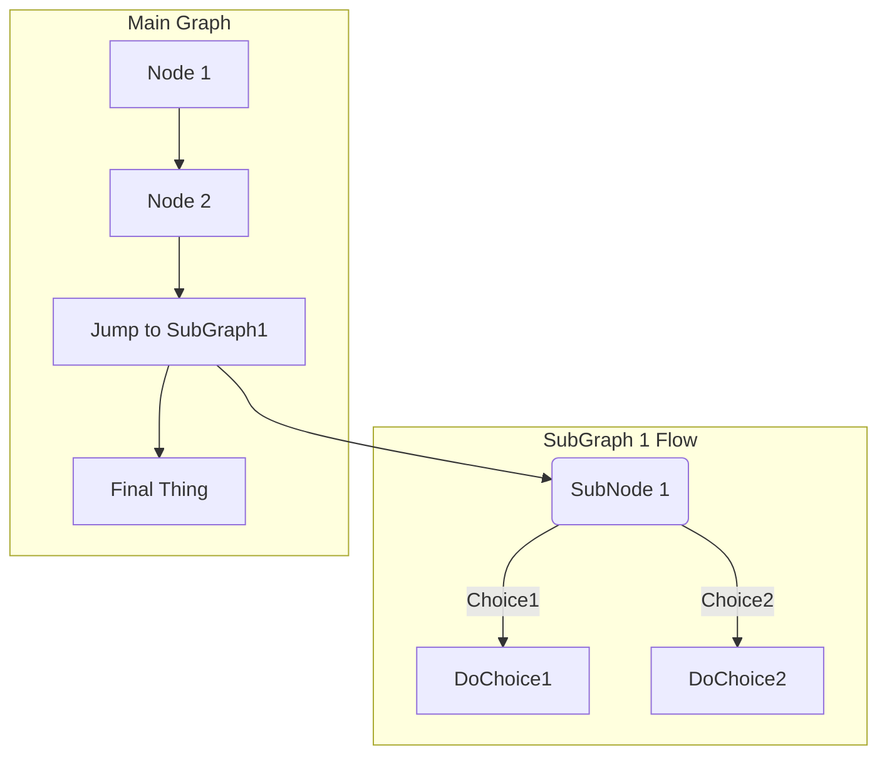
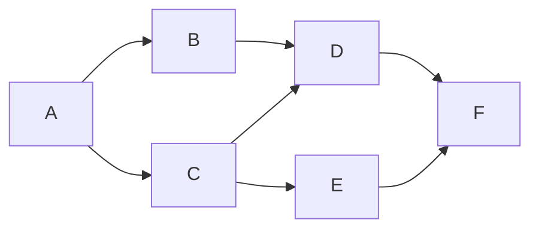
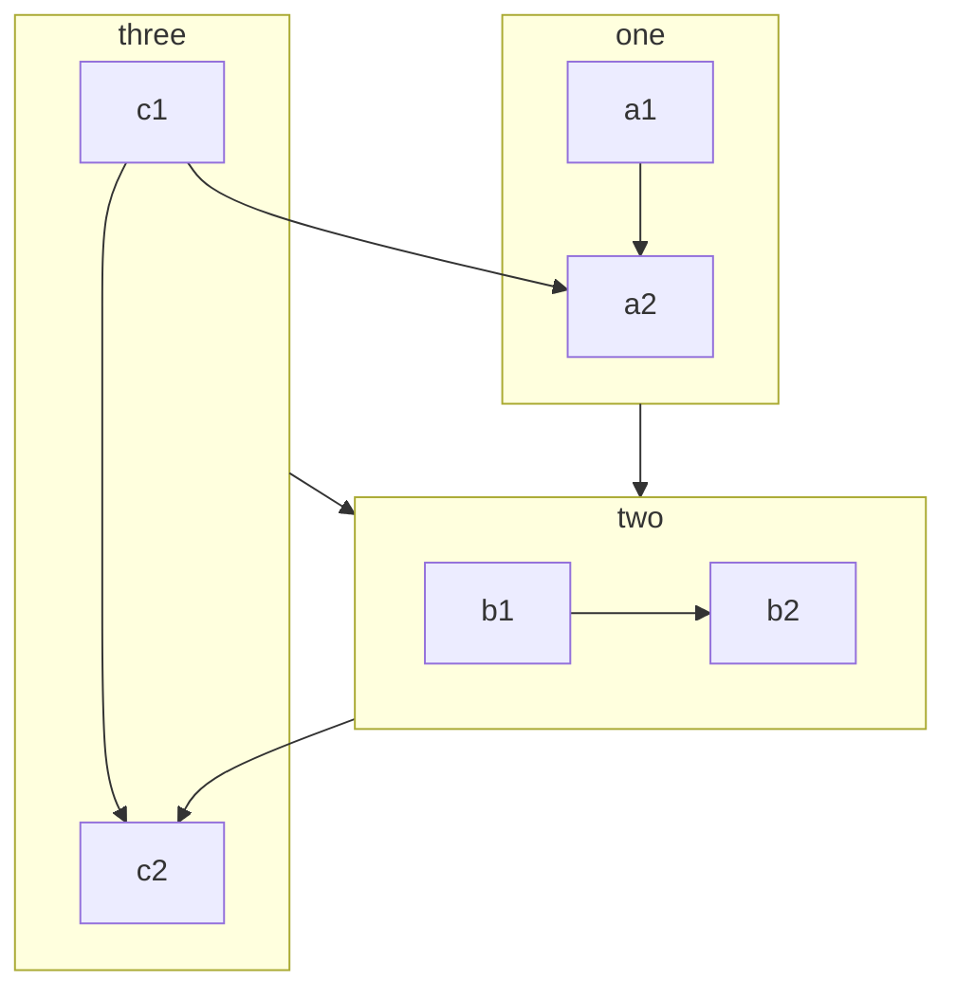
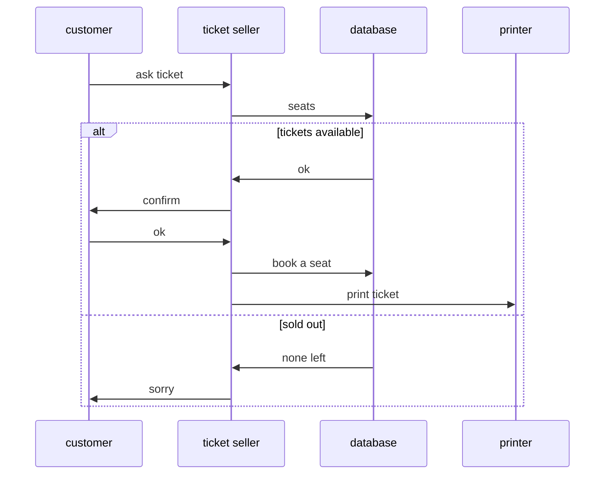

## graph flowchart

- https://docs.gitlab.com/ee/user/markdown.html
- https://jojozhuang.github.io/tutorial/mermaid-cheat-sheet/
- https://unpkg.com/mermaid@0.5.3/dist/www/flowchart.html#styling-and-classes
- https://www.rstudio.com/wp-content/uploads/2015/02/rmarkdown-cheatsheet.pdf





- https://rich-iannone.github.io/DiagrammeR/mermaid.html
- http://blockdiag.com/en/blockdiag/examples.html#edge-folding



```
Beta: flowcharts
```
https://mermaid-js.github.io/mermaid/#/flowchart?id=beta-flowcharts



https://michelf.ca/projects/php-markdown/extra/#fenced-code-blocks

```
css for mermaid

<style>
/*svg[id^="mermaid-"] { 
    min-width: 400px; max-width: 500px; max-height: 800px; font-size: 30px
     }
*/

/*.mermaid {width:200% !important}*/

/*svg[id^="m"][width][height][viewBox] {
    max-width: 95%;
    max-height: 95%;
}

div.mermaid {
    margin-left: 0 !important;
    text-align: center;
    resize:both;
    overflow:auto;
    margin-bottom: 2px;
    position:relative;
    max-height: 600px;
    max-width: 100%;
}

div.mermaid::after {
    content:'';
    display:block;
    width:10px;
    height:10px;
    background-color:yellowgreen;
    position:absolute;
    right:0;
    bottom:0;
}*/

/*.mermaid svg { 
  max-width: 100%; 
  height: 800px;
}
div.mermaid {
    text-align: center;
}*/

/*svg[id^="m"][width][height][viewBox] {
    width: auto;
    height: 800px;
}*/
</style>
```


```
https://rich-iannone.github.io/DiagrammeR/mermaid.html
sequenceDiagram
```


```
</tyle>
    div.mermaid {
        filter: invert(1) !important;
        background: #115;
    }
</style>
```

-------------------------------------------------------------------


