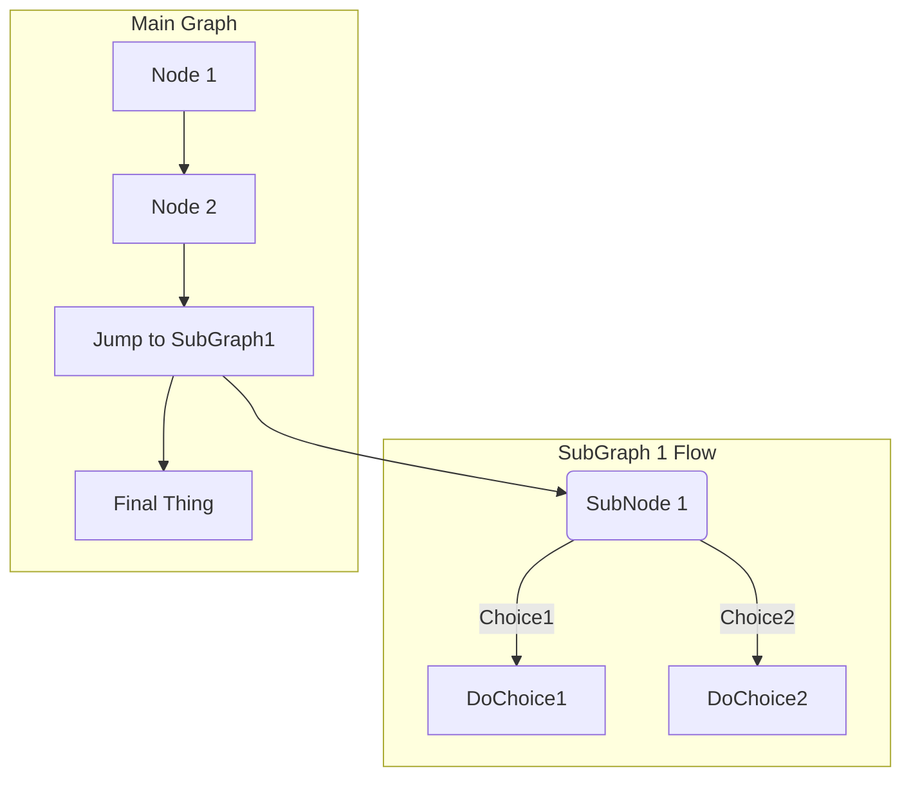
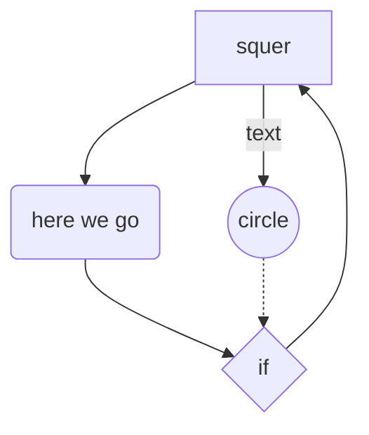
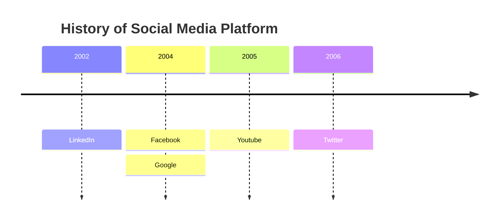
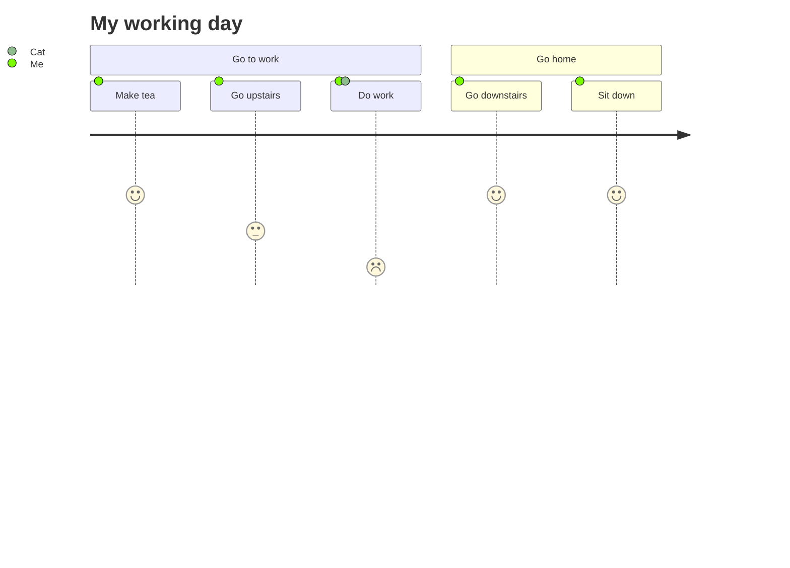
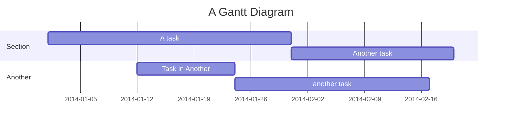
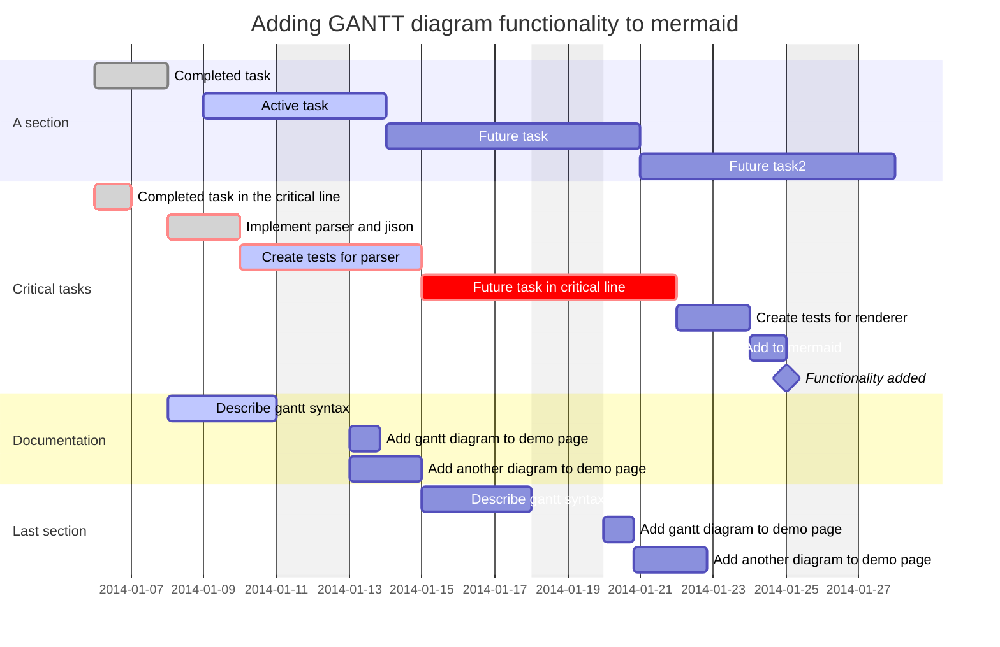

## markdown mermaid flow chart

- https://www.jetbrains.com/help/idea/markdown.html#diagrams
- https://mermaid-js.github.io/mermaid/#/
- https://www.jetbrains.com/help/idea/markdown-reference.html
- https://plugins.jetbrains.com/plugin/7793-markdown
- https://docs.gitlab.com/ee/user/markdown.html




----------------------------------------------------
### Flowchart mermaid example





 - https://mermaid-js.github.io/mermaid/#/flow
 - https://marketplace.visualstudio.com/items?itemName=bierner.markdown-mermaid


~~~
https://www.drawio.com/
https://www.smartdraw.com/uml-diagram/uml-diagram-tool.htm
https://app.smartdraw.com/?nsu=1
https://app.diagrams.net/
https://miro.com/diagramming/online/#
~~~

https://mermaid.js.org/syntax/timeline.html


    
    









```mermaid
```

